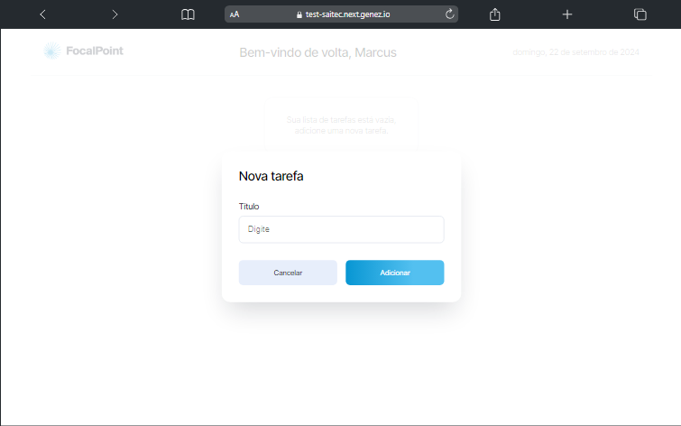

# 📄 Task list

## 💻 Deploy



<a href="https://test-saitec.next.genez.io/">Clique aqui para ver o projeto</a>

## 📝 Descrição

Esse gerenciador de tarefas é uma ótima ferramenta para quem deseja organizar suas atividades diárias, com uma interface simples e funcionalidades eficazes.

## 🔧 Instalação

Instalação com npm

```bash
  git clone "https://github.com/rogervalentim/test.git"
  cd test
  npm install
```

## 🔌 Como Rodar

```bash
  npm run dev
```

## 📊 Tecnologias e libs utilizadas

<ul>
<li>Next js</li>
<li>TypeScript</li>
<li>Scss</li>
</ul>
